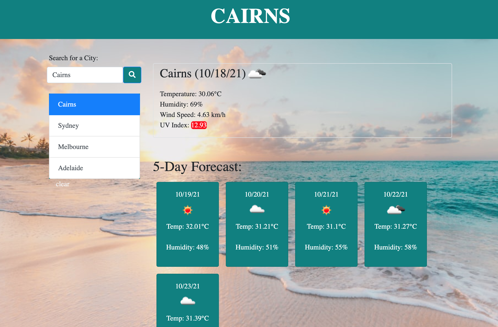

# Weather-Dashboard

## About this assignment

Using the Open Weather One Call API I have created a website that allows the user to search a city and then be shown both the current weather and a 5-day forecast.

### The app has the following features:
1. When you search a city it is added to a search history list.
2. The UV index changes colour to indicate whether the conditions are favourable. moderate or severe.
3. The user can then click on a city from the search history and again be presented withe the current and future conditions.

### Obstacles I Faced
I struggled to get the UV index to change colour based on it's severity and I also found in confusing to switch the temperature to degrees celsius.
However, after some researching I found the answers to both of my problems. 
The UV index is linked to a series of response conditions that and then styled in the css to make the colour change accordingly. 
Switching the units from imperial to metric was fixed by checking the Open Weather documentation and find the correct html codes for degrees celsius. 

### This application has been deployed at a live URL which you can see here: 
 https://marcmalliate.github.io/Weather-Dashboard/

### You may also like to view the GitHub repository which contains the code repository: 
https://github.com/marcmalliate/Weather-Dashboard

### Screenshot of application:

© 2021 Marc Malliate# Third-Party-APIs